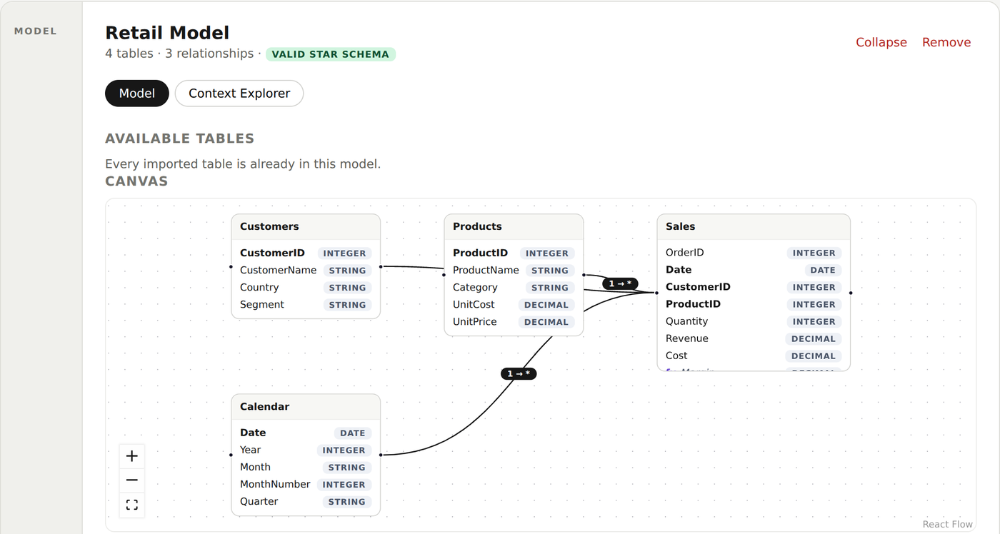
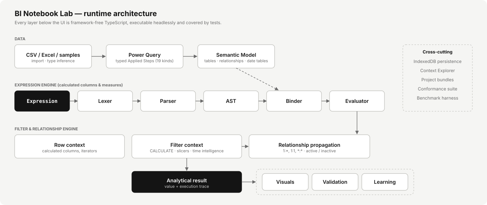
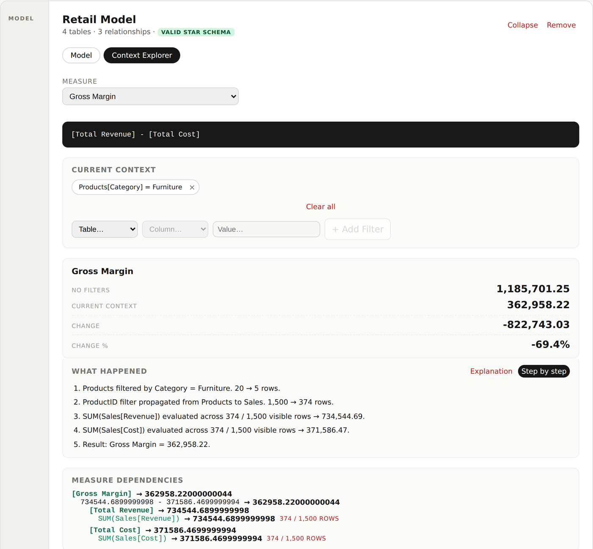
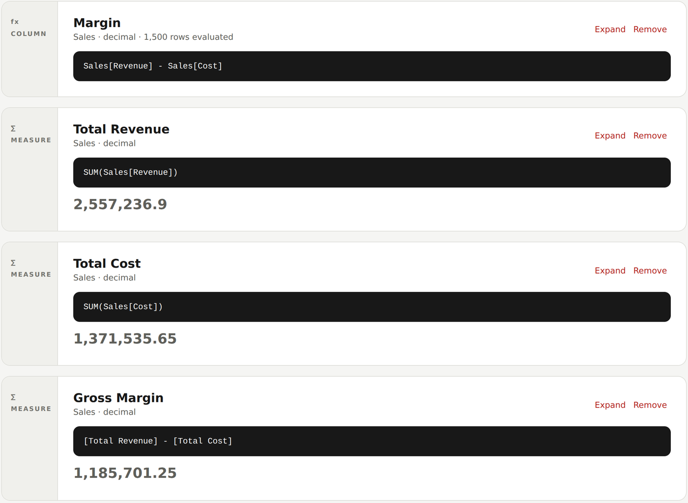
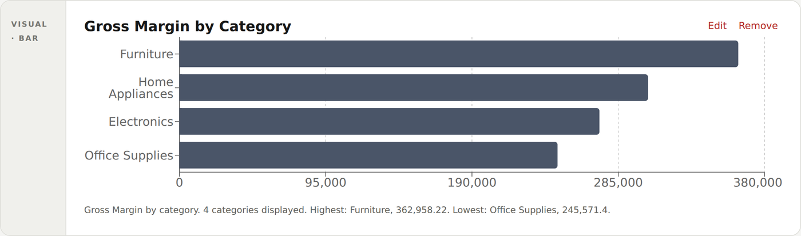
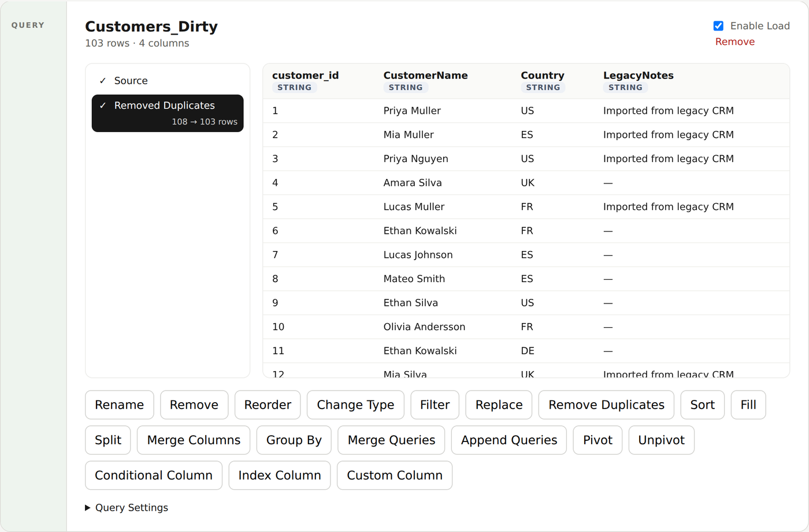
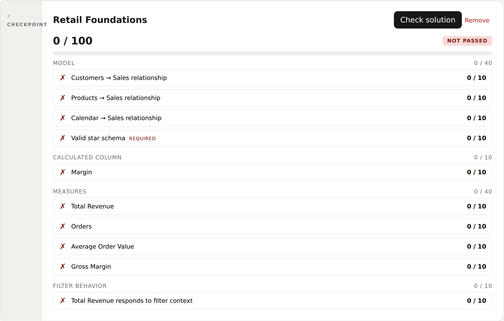
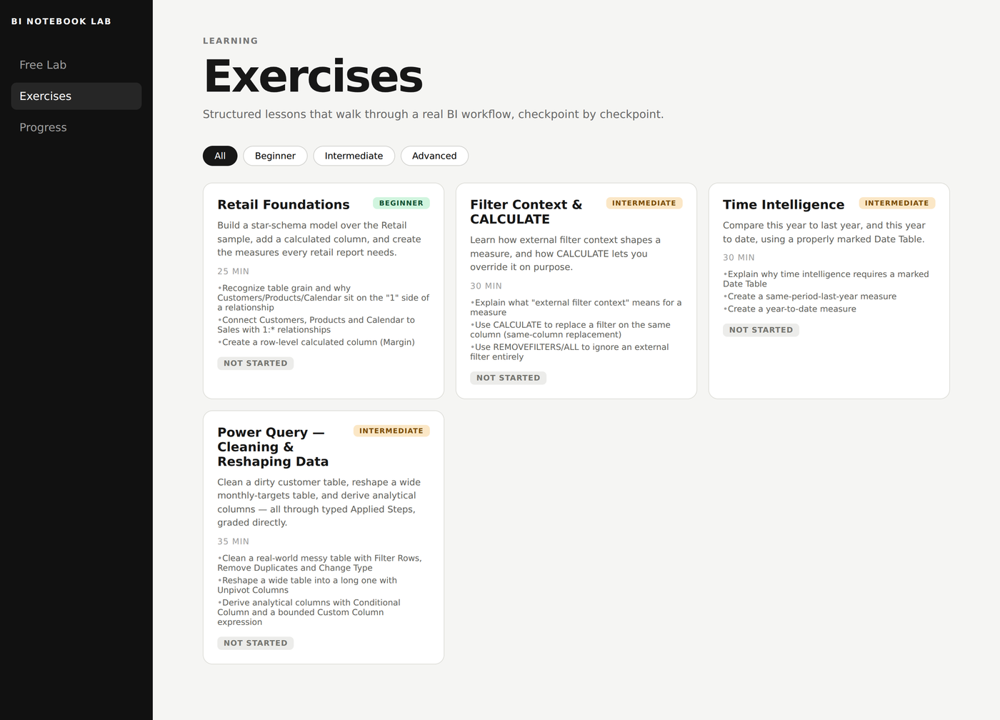
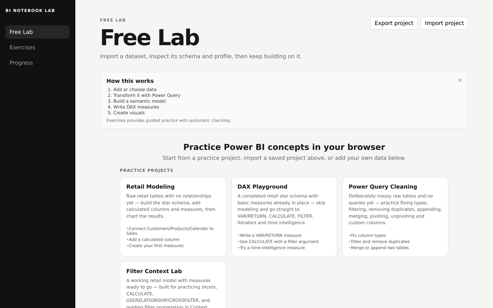

<div align="center">

# BI Notebook Lab

**A browser-based lab for learning how BI semantic models actually compute.**

It covers a bounded, educational subset of Power BI concepts (Power Query, star schemas, DAX, filter context), with a real expression engine behind every cell and automatic grading of what you build.

[](https://github.com/RaulMermans/bi-notebook-lab/actions/workflows/ci.yml)




</div>

> **Not a Power BI replacement.** BI Notebook Lab implements a deliberately bounded subset of Power BI semantics to teach the mental model. Where it diverges from real DAX, the divergence is documented and tested. See [Semantic honesty](#semantic-honesty).

## What it solves

Practising Power BI usually means Power BI Desktop, often on a shared virtual machine at work, which makes quick experiments awkward. BI Notebook Lab runs entirely in the browser: local-first (IndexedDB), with no backend, no account and no telemetry. You build a model step by step and get immediate feedback on whether it **behaves** the way you think, not just whether a chart renders.

```text
Dataset → Power Query → Model → Calculated Column → Measure → Visual → Question → Test
```

Each concept is an executable notebook cell: `DataCell`, `QueryCell`, `ModelCell`, `CalculatedColumnCell`, `MeasureCell`, `VisualCell` and `TestCell`.

## Architecture



- **One expression engine.** Calculated columns and measures share the same lexer → parser → AST → binder → evaluator pipeline. Measures bind through a second binder over the *same* engine, not a copy.
- **One measure runtime for everything.** Visuals, the Context Explorer and the validation engine all evaluate through the same `evaluateMeasure`. There is no second aggregation engine that could disagree.
- **Explicit filter context.** Direct filters, relationship propagation (1:\*, 1:1, \*:\*, single and bidirectional, active and inactive), `CALCULATE` replacement semantics, and a fail-closed guard against ambiguous or cyclic relationship paths.
- **Headless by rule.** React only renders state. Every layer beneath it is framework-free TypeScript that runs in tests without a browser (an enforced guardrail in [`AGENTS.md`](./AGENTS.md)).

More detail: [`ARCHITECTURE.md`](./ARCHITECTURE.md) · [`docs/EXPRESSION_ENGINE.md`](./docs/EXPRESSION_ENGINE.md) · [`docs/FILTER_CONTEXT.md`](./docs/FILTER_CONTEXT.md)

## Key engineering decisions

| Decision | Why |
| --- | --- |
| **Grade by execution, not string matching** | The validation engine runs your model and measures through the real runtime across several filter contexts, so a hard-coded constant can't pass. It has weighted partial credit, required rules, and a staleness fingerprint so an outdated PASS is never shown as current. |
| **Typed Applied Steps instead of an M interpreter** | Power Query is modelled as 19 typed step kinds that can be inspected and graded, with no arbitrary M execution. |
| **Conformance labelled by provenance** | DAX cases are hand-verified and labelled by where the expected value came from, never claimed as "Power BI-verified". |
| **Known divergences are tests, not footnotes** | `BLANK() + 5` returns `BLANK()` here, where real DAX returns `5`. It is kept as a skipped conformance case that states the reason. |
| **Local-first** | IndexedDB persistence and portable `.bilab.json` project bundles, with no server to trust or run. |

## Evidence

Measured on the current `main` with `npm test`, `npm run conformance`, `npm run typecheck`, `npm run build` and `npm run benchmark`:

| Check | Result |
| --- | --- |
| Unit and integration tests | **1,024 passing**, 1 skipped (115 test files) |
| DAX semantic conformance | **82 of 83** hand-verified cases pass. The 1 skipped case is the documented divergence above. |
| Type checking | `tsc -b` clean |
| Production build | Passes |
| End-to-end (Playwright) | 2 user journeys: first-time Free Lab, and portable project export/import |
| Performance harness | 17 runtime operations at 1k / 10k / 50k / 100k rows. None exceeded 1 s; the slowest is about 250 ms at 100k rows. |

Performance figures come from Node/V8, not a browser tab under UI load, so the shape of the result matters more than the exact milliseconds. See [`docs/PERFORMANCE.md`](./docs/PERFORMANCE.md).

## Screenshots

**Context Explorer.** Choose a measure, add a filter, and see how it propagates through relationships, step by step, down to the rows that were evaluated.



| Measures over the semantic model | Visuals on the same measure runtime |
| --- | --- |
|  |  |

| Power Query (typed Applied Steps) | Automatic checkpoint grading |
| --- | --- |
|  |  |

| Guided exercises | Free Lab and practice projects |
| --- | --- |
|  |  |

<sub>All screenshots show the app's built-in synthetic sample data.</sub>

## Capabilities

### Feature matrix

| Area | Status |
|---|---|
| CSV / Excel import | ✓ |
| Power Query (typed Applied Steps, 19 kinds) | ✓ |
| Semantic model (generic relationships, `USERELATIONSHIP`/`CROSSFILTER`) | ✓ |
| Calculated columns | ✓ |
| Measures | ✓ |
| `CALCULATE` | ✓ |
| Iterators (`SUMX`/`AVERAGEX`/...) & table expressions | ✓ |
| `VAR`/`RETURN`, `ISBLANK`, `HASONEVALUE`, `KEEPFILTERS` | ✓ |
| Classic time intelligence | ✓ |
| Visuals (KPI/Bar/Line/Table/Slicer) | ✓ |
| Context Explorer (filter-propagation trace) | ✓ |
| Automatic validation / guided Exercises | ✓ |
| Portable project export/import (`.bilab.json`) | ✓ |
| Practice Projects & onboarding | ✓ |
| Semantic conformance suite | ✓ |
| Calculated Tables, `CALENDAR`/`CALENDARAUTO`, `SUMMARIZE` | ✗ (deferred) |
| Full DAX / full M compatibility | ✗ (bounded subset, by design) |
| PBIX/PBIP import, Fabric integration | ✗ (out of scope) |
| Accounts, collaboration, backend | ✗ (out of scope) |


### Semantic honesty

This project implements a **bounded educational subset** of Power BI
semantics — not full DAX, not full M, not a Power BI replacement. It backs
that claim with a conformance suite (`npm run conformance`): 83
hand-verified DAX cases across 10 families, run through the real runtime
APIs, honestly labeled by provenance rather than claimed as
`power-bi-verified`.

One known divergence is tracked deliberately rather than hidden: `BLANK() +
5` returns `BLANK()` here, where real DAX coerces blank to `0` for `+`. This
codebase propagates blank uniformly through every arithmetic operator
instead of replicating DAX's per-operator coercion table. See
[`docs/SEMANTIC_CONFORMANCE.md`](./docs/SEMANTIC_CONFORMANCE.md) for the
full list of what's verified and what's still approximate.

## Tech stack

TypeScript · React 18 · Vite · React Flow (`@xyflow/react`) · Recharts · PapaParse and SheetJS (CSV/Excel import) · IndexedDB (`idb-keyval`) · Vitest (+ `fake-indexeddb`) · Playwright

## Status

**V1 complete.** The full learning loop works end to end: import → Power Query → model → calculated columns → measures → filter context → visuals → validation → guided lessons.

Deferred: calculated tables, `CALENDAR`/`CALENDARAUTO` and `SUMMARIZE`. Out of scope: PBIX/PBIP import, Fabric, accounts and collaboration. See [`ROADMAP.md`](./ROADMAP.md).

### Limitations

- A bounded subset of DAX and Power Query. It is not full DAX or M.
- Blank handling in arithmetic differs from real DAX (documented and tested).
- Performance is measured headlessly under Node/V8; very large datasets (beyond the 100k-row tested limit) are not a goal.
- Browser-only persistence: projects live in IndexedDB until you export them.

## Run locally

Requires Node.js 20+.

```bash
npm install
npm run dev          # http://localhost:5173
npm test             # unit + integration
npm run conformance  # DAX conformance suite
npm run benchmark    # performance report
npm run test:e2e     # Playwright journeys
```

Start from a practice project in **Free Lab** (Retail Modeling, DAX Playground, Power Query Cleaning or Filter Context Lab), or import your own CSV/Excel. A step-by-step tour is in [`docs/WALKTHROUGH.md`](./docs/WALKTHROUGH.md).

## Documentation

- [`PRODUCT.md`](./PRODUCT.md)
- [`ARCHITECTURE.md`](./ARCHITECTURE.md)
- [`ROADMAP.md`](./ROADMAP.md)
- [`docs/CELL_SPEC.md`](./docs/CELL_SPEC.md)
- [`docs/LEARNING_MODEL.md`](./docs/LEARNING_MODEL.md)
- [`docs/VALIDATION_ENGINE.md`](./docs/VALIDATION_ENGINE.md)
- [`docs/DATA_RUNTIME.md`](./docs/DATA_RUNTIME.md)
- [`docs/MODEL_RUNTIME.md`](./docs/MODEL_RUNTIME.md)
- [`docs/EXPRESSION_ENGINE.md`](./docs/EXPRESSION_ENGINE.md)
- [`docs/CALCULATED_COLUMNS.md`](./docs/CALCULATED_COLUMNS.md)
- [`docs/MEASURES.md`](./docs/MEASURES.md)
- [`docs/FILTER_CONTEXT.md`](./docs/FILTER_CONTEXT.md)
- [`docs/CONTEXT_VISUALIZER.md`](./docs/CONTEXT_VISUALIZER.md)
- [`docs/VISUAL_CELLS.md`](./docs/VISUAL_CELLS.md)
- [`docs/CALCULATE.md`](./docs/CALCULATE.md)
- [`docs/TABLE_EXPRESSIONS.md`](./docs/TABLE_EXPRESSIONS.md)
- [`docs/ITERATORS.md`](./docs/ITERATORS.md)
- [`docs/DATE_TABLES.md`](./docs/DATE_TABLES.md)
- [`docs/TIME_INTELLIGENCE.md`](./docs/TIME_INTELLIGENCE.md)
- [`docs/ADVANCED_RELATIONSHIPS.md`](./docs/ADVANCED_RELATIONSHIPS.md)
- [`docs/USERELATIONSHIP.md`](./docs/USERELATIONSHIP.md)
- [`docs/POWER_QUERY_RUNTIME.md`](./docs/POWER_QUERY_RUNTIME.md)
- [`docs/APPLIED_STEPS.md`](./docs/APPLIED_STEPS.md)
- [`docs/POWER_QUERY_EXPRESSIONS.md`](./docs/POWER_QUERY_EXPRESSIONS.md)
- [`docs/LEARNING_SYSTEM.md`](./docs/LEARNING_SYSTEM.md)
- [`docs/QUERY_VALIDATION.md`](./docs/QUERY_VALIDATION.md)
- [`docs/WORKSPACE_INTEGRITY.md`](./docs/WORKSPACE_INTEGRITY.md)
- [`docs/SEMANTIC_CONFORMANCE.md`](./docs/SEMANTIC_CONFORMANCE.md)
- [`docs/PROJECT_BUNDLE.md`](./docs/PROJECT_BUNDLE.md)
- [`docs/PERFORMANCE.md`](./docs/PERFORMANCE.md)
- [`docs/E2E_TESTING.md`](./docs/E2E_TESTING.md)
- [`docs/WALKTHROUGH.md`](./docs/WALKTHROUGH.md): hands-on tour of every feature
- [`docs/DEVELOPMENT_HISTORY.md`](./docs/DEVELOPMENT_HISTORY.md): sprint-by-sprint record

## Scope guardrail

Do **not** attempt to recreate Power BI Desktop, Microsoft Fabric, or full
DAX compatibility. Power Query is now in scope, but only its Applied Steps
transformation workflow (Sprint 12) — not an arbitrary M parser/interpreter,
query folding, the Advanced Editor, custom M functions, connectors,
parameters, or dataflows. See `docs/POWER_QUERY_RUNTIME.md` "M-language
boundary".

The learning target is the smallest runtime that can faithfully teach the mental models used in real BI work.
